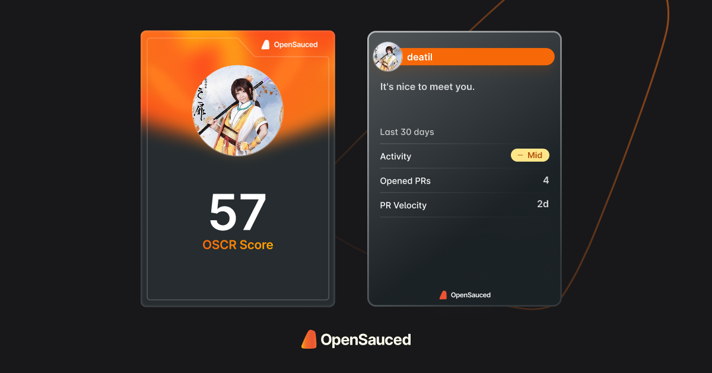

<!-- Custom Welcome Banner -->

  

<!-- Profile views

 
   

 -->

<!-- About Me -->

### 💫 About Me

- 🖥 I'm an Engineer
- 🥇 Running, Cycling, Swimming
- 🌱 I’m currently learning DevOps
- 🎯 Open to collaborating with open source enthusiasts
- 🥅 2024 Goals: DevOps, Springboot, AWS And DSA

 

## 🌐 Socials:

  
  
  
  
  

    

    <picture>
      <source media="(prefers-color-scheme: dark)"  srcset="https://raw.githubusercontent.com/sadath2001/sadath2001/output-3d-contrib/night.svg" />
      <source media="(prefers-color-scheme: light)" srcset="https://raw.githubusercontent.com/sadath2001/sadath2001/output-3d-contrib/day.svg" />
      
    </picture>
  

## 💻 Tech Stack:

## 🎖 My Badges:

	
 
<b>GSSOC(24)-Ext Badges 🪶</b>
 

  
<b> HoloPin Badges </b>

  

## 🚀 Open Source Contributions:

  
<b>GSSOC 24 - Ext</b>

  
 <table width="100%" align="center">
   <tr>
     <td>GirlScript Summer of Code - Ext (GSSoC'24) </td>
     <td>
       <ul>
         <li>Role: <strong>Open Source Contributor</strong></li>
         <li>Contributed to open-source projects.</li>
       </ul>
     </td>
   </tr>
   <tr>
     <td>Hacktoberfest 24</td>
     <td>
       <ul>
         <li>Role: <strong>Open Source Contributor</strong></li>
         <li>Part of GSSOC-ext</li>
       </ul>
     </td>
   </tr>
 </table>

## 🧮 Stats:

  
<b>GitHub statistics</b>

   
  

  

    
    
    
    

    
  

   
    

  <b>Thank you for visiting my profile! If you appreciate my work, consider buying me a coffee. 😊</b>

  
  

  

